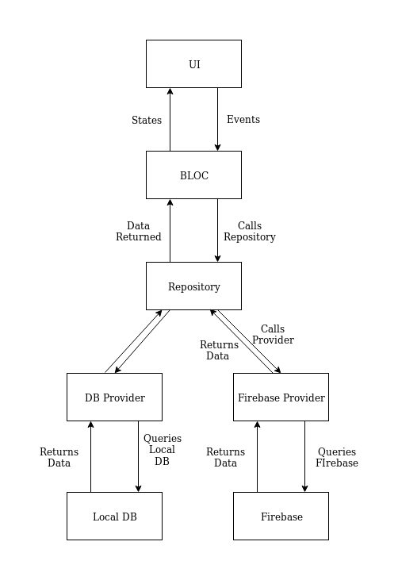

- axios
- dependency injection
- native base
- formik

## Repository pattern flow:



## Explaination:

- UI : Contains the Widgets and the screen the user interacts with. Every interaction like a button click, a scroll, etc can be mapped to a Event and passed on to the BLoC.
- BLoC : A BLoC takes the current State and the Event, maps it to a different State by using the necessary business logic. It is also responsible for interacting with the repository for any data required.
- Repository : The repository acts as a interface between a BLoC and all the providers. In the diagram we have multiple providers in form of Firebase and Local DB. The repository is responsible for deciding which of these providers to call.
- Providers : The providers call the actual data sources. All the network call related codes and all the DB query related code are kept in these providers. The result from the providers are passed on to the repository.
- Data Source : These are the actual data sources.

## How to run 
develop 

``` bash
#develop
make run-android-dev
make run-ios-dev
#staging
make run-android-staging
make run-ios-staging
#production
make run-android-production
make run-ios-production
```

## Specification
| name | version |
|---|---|
| typescript | 0.0.0
| reactnative | 0.0.0
| react-navigation | 0.0.0

